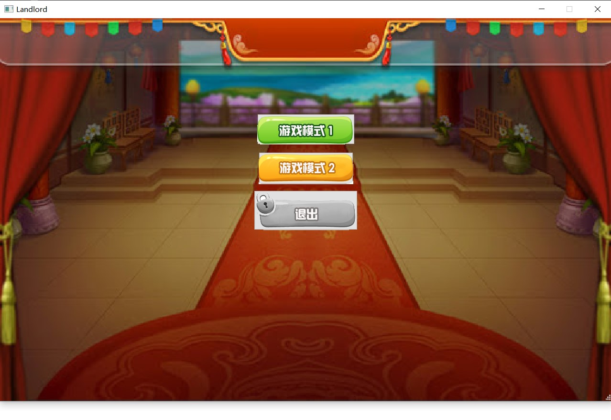

# 中期报告

## 分工

- 姜唯：组长，负责游戏界面显示的设计和实现，总体架构设计，`card`类设计，辅助组员完成游戏逻辑设计
- 叶辰臻：网络逻辑模块，游戏规则判定设计
- 胡絮燕：网络逻辑模块，游戏规则判定设计

## 目标任务

### 概要

- 实现友好的图形用户界面
- 支持两种斗地主游戏，第二种模式为排位赛
- 支持3人游戏
- 支持单人游戏，不足人数将由AI来代替
- 支持不同玩家局域网内联机参与游戏

### 游戏设计

- 第一次进入游戏时，跳出对话框提示玩家输入玩家姓名（注册）；

- 进入游戏的开始界面：（暂定）
  - 选择游戏模式：模式1或模式2
  - 联机游戏，进入后可以选择创建房间和加入房间；
  - 设置
  - 退出

- 游戏界面：（暂定）
  - 进入游戏时如果是单机游戏随机初始化AI姓名；
  - 图形化显示三张地主牌（一开始覆盖好，游戏开始之后显示地主牌）；
  - 图形化列表显示玩家手上的牌；
  - 显示参与的玩家列表，列表中显示：
    - 玩家姓名；
    - 玩家当前牌数；
  - 显示当前玩家操作剩余时间；
  - 两个出牌按钮：出牌、不要
  - 出牌不符合规则时弹出错误提示框
  - 获胜时跳出对话框：WIN!
  - 部分牌组合的效果（如炸弹、王炸、顺子）

## 系统开发进度和计划
### 网络通讯部分

***

#### 2021/05/26-05/30

1、查阅相关资料；  
2、选定通信协议(tcp)。

### 游戏规则判定部分

***

#### 2021/05/23-05/30

1、搜集整理资料，了解大致的框架和所需的类；  
2、设计游戏规则，了解扑克牌出牌的可能的组合。

### 界面显示部分

***

#### 2021/05/23-05/29

1、搜集整理资料，选定使用QT作为ui框架，负责此部分的组员正在学习相关内容；  
2、设计各个类。

#### 2021/05/30-05/31

1、初步设计好登录界面

