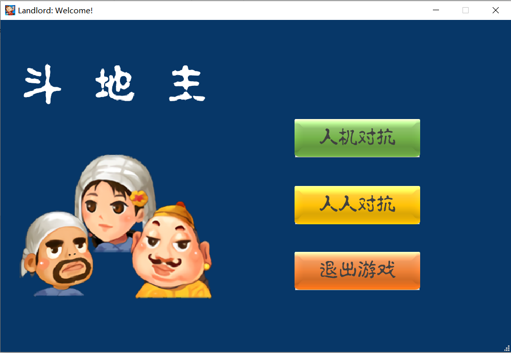

# 需求分析
斗地主，是一种在中国流行的纸牌游戏。是关于旧社会阶级斗争详见土地改革运动。 斗地主是一种扑克游戏。游戏最少由3个玩家进行，
用一副54张牌（连鬼牌），其中一方为地主，其余两家为另一方，双方对战，先出完牌的一方获胜。该扑克游戏最初流行于湖北武汉市
汉阳区，现已逐渐在全球各地流行。

本项目旨在设计并开发一款单机斗地主游戏，让用户体验斗地主的快乐。

## 斗地主游戏的基本功能
+ 友好的用户界面
+ 支持2中斗地主模式：人机对抗和人人对抗
+ 支持单人游戏，其他参与者为AI

## 斗地主游戏规则
有关斗地主规则介绍见百度百科相关词条：[斗地主规则](https://baike.baidu.com/item/%E6%96%97%E5%9C%B0%E4%B8%BB/177997)

# 总体设计
本课程设计基于Qt和C++实现一个具有友好图形界面的斗地主游戏。本游戏支持两种模式：传统斗地主模式，即游戏中有一个地主与两个平民，
玩家通过叫分来“抢地主”；大乱斗模式，即游戏中扑克牌平分（每个人18张牌），每个玩家都是“地主”身份，判定胜利的标准为**自己手中牌是否已经为空**。

游戏支持单人模式，其余两个玩家由电脑AI代替。

本组采用git进行协作开发，仓库地址：
//todo

分工：
+ 姜唯：组长，负责前端设计与开发（即初界面与游戏界面的设计、界面跳转设计）、统筹规划与编写设计报告；
+ 胡絮燕：组员，参与设计后端的Card，Player，PlayerAI，User，Stragety类，负责完成后端出牌策略；
+ 叶辰臻：组员，参与后端实现，负责前后端部分接口设计以及游戏模式2实现。

# 系统模块申明
斗地主游戏设计采用前后端分离的模式，前端负责界面的设计与开发，后端负责游戏逻辑与对局AI的设计和开发。

## 前端设计
斗地主游戏的前端主要负责显示界面，游戏中设计了两个界面：初界面和游戏界面。这两个界面均为QMainWindow的派生类。

## 后端设计
//todo

# 程序运行界面
## 初界面

## 游戏界面
点击进入“初界面”中的“人机对抗”，进入游戏界面：

点击“开始游戏”，进入叫分环节：

叫三分，此时用户为地主：

假设打出一张方块3牌，左侧、右侧玩家出牌后，对局界面截图如下所示：

继续打牌，直到分出胜负，界面截图如下图所示：

# 系统设计难点及解决

# 总结
本次课程设计是一次大型程序设计，斗地主游戏的设计与开发包括了面向对象设计思维、Qt框架等方面。在程序的设计过程中，本组遇到了很多的问题与困难，这些困难有一部分是源自对C++
以及Qt图形库相关特性的不够了解，有一部分是来自于团队合作开发大型程序的经验的缺失。针对源自知识层面的问题与困难，本组的解决方案主要包括一下几条：
+ 查阅官方文档，比如Qt库本组查阅了Qt的官方文档[Qt 5.14](https://doc.qt.io/qt-5.14/index.html)；
+ 查阅Qt相关论坛，如[Qt Forum](https://forum.qt.io/)；
+ 查阅[Stackoverflow](https://stackoverflow.com/)等平台，获取信息。

针对组队合作经验的缺失带来的问题，本组采取的解决方案为：
+ 三个人尽可能的线下交流，坐在一起讨论往往精力更加集中；
+ 分工合作，明确每一个人的任务，并且了解自己负责的部分对接哪些其他组员负责的部分；
+ 讨论后及时把讨论的内容以纸质版或者电子版的形式记录下来（可以使用mindnote等软件创建思维导图）。

通过本次大型程序设计，本组组员体会到了：
+ 面向对象的程序设计思想给软件开发带来的便利。与传统面向过程的程序设计不同，面向对象的程序设计思想要求我们抽象出类，将程序的操作变量与执行过程转换为类与类的属性。本次程序设计过程中，本组设计了大量的类、继承、模板等，这大大简化了开发过程，降低了开发难度。
+ 提升了团队协作能力。本组使用git进行版本控制与代码管理，并且通过高强度的线下讨论清晰了各个模块的设计。今后的软件开发，这次程序设计的经验将会帮助我们做好相关工作。

# 程序使用说明
+ 在游戏的初界面，有三个按钮：人机对抗、人人对抗以及退出游戏。如果点击“人机对抗”，则进入游戏模式1，即传统的斗地主模式；如果点击“人人对抗”，则进入游戏模式2，即每个玩家都是“地主”，每个玩家获胜的条件都是自己手中的牌最先打完。
+ //todo

# 系统开发日志
## 系统开发日志--后端：
### 

## 系统开发日志--前端：
### 2021/05/30-06/02
+ 初步设计好登录界面
+ 初步完成初界面到游戏界面的跳转功能
### 2021/06/02-06/18：
+ 调研游戏界面的实现
+ 初步设计好游戏界面头文件（对应于"gamewindow.h"的实现）
### 2021/06/19-06/24：
+ 基本完成游戏模式1的发牌显示、叫分显示、出牌功能，以及显示胜利/失败功能
+ 调研游戏界面之游戏模式2的实现
### 2021/06/25-06/27：
+ 基本完成游戏模式1的发牌显示、出牌功能，以及显示胜利/失败功能
+ 修正部分bug
+ 优化代码
### 2021/07/08-07/09：
+ 优化前端API，删除冗余代码
+ 修正部分bug